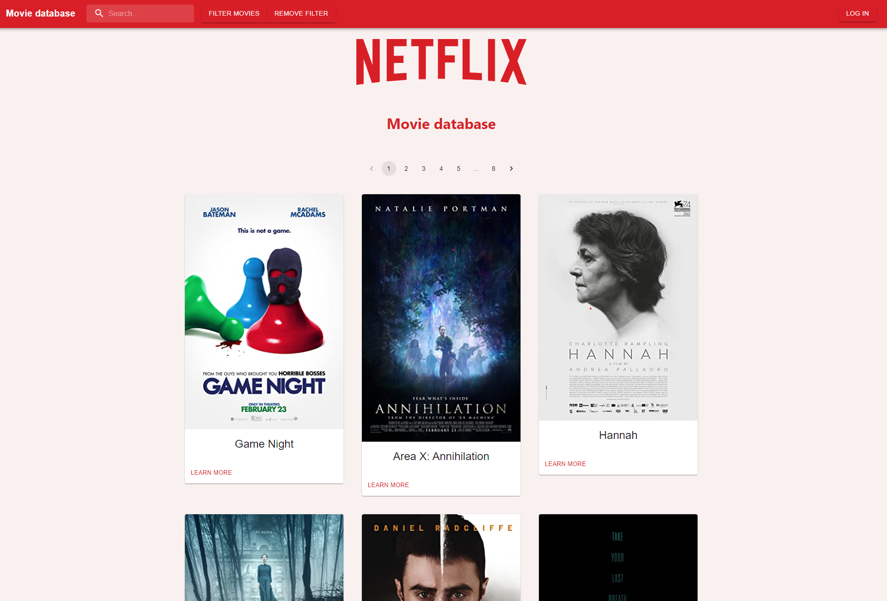

<div id="top"></div>


<!-- PROJECT SHIELDS -->
<!--
*** This layout reused from an other project Sebastian Veum has created. 
*** Sebastian is the author of the original version with some inspiration from the web.
-->

<!-- PROJECT LOGO -->
  [](https://gitlab.stud.idi.ntnu.no/it2810-h21/team-38/prosjekt-3/-/pipelines)

<br />
<div align="center">
  <a href="https://gitlab.stud.idi.ntnu.no/it2810-h21/team-38/prosjekt-3">
    
  </a>

<h3 align="center">Project 3</h3>

  <p align="center">
    The second group project created by team 38. A group of four members. 
    <br />
    <a href="https://gitlab.stud.idi.ntnu.no/it2810-h21/team-38/prosjekt-3"><strong>Explore the docs »</strong></a>
    <br />
    <br />
    <a href="https://gitlab.stud.idi.ntnu.no/it2810-h21/team-38/prosjekt-3/-/issues">Issues</a>
    ·
    <a href="https://gitlab.stud.idi.ntnu.no/it2810-h21/team-38/prosjekt-3/-/commits/master">Commits</a>
    ·
    <a href="https://gitlab.stud.idi.ntnu.no/it2810-h21/team-38/prosjekt-3/-/wikis/home">Wiki</a>
  </p>
</div>


<!-- TABLE OF CONTENTS -->
<details>
  <summary>Table of Contents</summary>
  <ol>
    <li>
      <a href="#about-the-project">About The Project</a>
      <ul>
        <li><a href="#built-with">Built With</a></li>
        <li><a href="#technologies">Technologies</a></li>
        <li><a href="#functionalities">Functionalities</a></li>
        <li><a href="#design">Design</a></li>
        <li><a href="#testing">Testing</a></li>
      </ul>
    </li>
    <li>
      <a href="#functionalities">Functionalities</a>
    </li>
    <li>
      <a href="#run-tests">Run tests</a>
      <ul>
        <li><a href="#prerequisites">Prerequisites</a></li>
        <li><a href="#test-backend">Test backend</a></li>
        <li>
          <a href="#test-frontend-cypress-and-unit">Test frontend</a>
          <ul>
            <li><a href="#cypress-test">Cypress test</a></li>
            <li><a href="#unit-test">Unit test</a></li>
          </ul>
        </li>
      </ul>
    </li>
    <li>
      <a href="#getting-started">Getting Started</a>
      <ul>
        <li><a href="#prerequisites">Prerequisites</a></li>
        <li><a href="#installation">Installation</a></li>
        <li><a href="#starting">Starting</a></li>
      </ul>
    </li>
    <li><a href="#usage">Usage</a></li>
    <li><a href="#license">License</a></li>
    <li><a href="#contact">Contact</a></li>
    <li><a href="#acknowledgments">Acknowledgments</a></li>
  </ol>
</details>


<!-- ABOUT THE PROJECT -->

</br>

<div align="center">
 <a href="https://gitlab.stud.idi.ntnu.no/it2810-h21/team-38/prosjekt-3">
    
  </a>
</div>


## About The Project

This project is created by Alexander, Iver, Sebastian and Victoria. 
The final result is based of requirement from the project description. 
By using Apollo server, MongoDB, react and other features is the final result what you are whatcing right now. Victoria has been the team leader during the project.

</br>


### Built With

* [React.js](https://reactjs.org/)
* [TypeScript](https://www.typescriptlang.org/)
* [JavaScript](https://www.javascript.com/)
* [GraphQL](https://www.apollographql.com/docs/)
* [Mongoose](https://mongoosejs.com/)
* [MongoDB](https://www.mongodb.com)
* [Node.js](https://node.com)

<div align="right">(<a href="#top">back to top</a>)</div>

### Technologies

Some technologies are required to use for this project and are therefore pre decided for us. With that is the interface based on react syntax. The project itself is initialized with create-react-app, npx create-react-app project-3, implemented in TypeScript.

Regarding the GraphQL database it was clearly Apollo we wanted to use as the service provides a vast open-source library that is extremely helpful in implementing GraphQL for JavaScript applications, as the backend is written in js.

#### Redux
For state management we decided to try redux, as it is more natural to use with functional programming. However, all members personally desired to learn Redux, even though MobX is easier to wrap your head around. 


#### MongoDB
As for databases, did we decide to use a nonSQL-database. Documentation naturally was decided to be stored in JSON, and therefore it became obvious to use MongoDB. As this service fits our preferences accurately, MongoDB offers several useful features such as MongoDB Compass for local launch of backend. As a pluss didn’t we need to worry about the data structure such as the number of fields or types of fields to store values.  

#### Mongoose 
For Node to translate between objects in code and the representation of those objects in MongoDB is an issue easily handled by mongoose. As MongoDB is schema-less Mongoose provides definitions of schema for the data models in order to specific document structure with predefined data types. Mongoose also makes returning updated documents or query results quite easier.


#### Apollo GraphQL Server/API and Client
The external library, Apollo server, was used to set up the server in the backend for the graphql APIs, meaning queries and mutations. The library, Apollo client, was used in the frontend to make API calls to the backend. Apollo client provides built in react hooks for graphql queries and mutations that are easy for use and easy to learn. The group chose to use Apollo server as this external component provides user friendly interface for testing your graphql mutations and queries. The server was instantiated with the defined [resolvers](https://www.apollographql.com/docs/apollo-server/data/resolvers/) and [schema](https://www.apollographql.com/docs/tutorial/schema/) for the queries and mutations that were made in the application. 

#### JSON Web Token 
In order to make all users unique and secure that only valid users may write reviews of movies did we find it necessary to relate each user to a token. JSON Web Token (jwt) gave us the opportunity to easily do so. This feature is used in authorization validations and register modules of the application. 


<div align="right">(<a href="#top">back to top</a>)</div>

### Functionalities

In order to satisfy the requirements for creating an application that provides opportunity for the user to view a large, paginated dataset but also filter and search on the dataset, the group chose to solve this by implementing a movie database that displays 95 movie records. The dataset was extracted from an existing json file from an open source github repo: [link](https://github.com/FEND16/movie-json-data/blob/master/json/movies-coming-soon.json).  
The group chose to create an application on movies since it was possible to find existing data which reduced the time from set-up to development substantially. 

The team chose to use redux for storing state that needed to be accessed by multiple components. In this case, the component `Appbar`, `Movies` and `FilterModal` needed access to the same states being the search queries (genre, year and search string on title). Thus, the team chose to implement the search queries as a state in redux store. This way, any components can update the search queries and use the stored search queries. The same is applied for the login functionality, where both the `Appbar`, `Login` and `Registration` component needs access to a common state that expresses whether a user is logged in or not.  

#### Movies

All movies are displayed in the application by default when a user visits the home page. Any user can see the displayed movies without being authenticated. 
As a user, it is possible to view movies and choose a page to load new dataset of movies. Each page displays 12 movies each. For instance, the first page displays the first 12 movies, the second page displays the 12 next and so on. Thus, the group decided to use offset limit based pagination to implement this functionality. The frontend updates the offset whenever a new page is selected. The reason behind the chosen design solution, is because it is easy to understand and implement in the client side, reduces overhead and it works on dataset that are static, meaning that will not be changed as in our case. 
 
 The team decided to implement this functionality by designing a single graphql query that takes in search queries optionally (selected genre, search string on title, and year range) which returns either filtered movies based on the provided parameters or display all movies from the database if no search queries were given as parameters. The frontend makes a call to this query for displaying the correct dataset of movies using the built in useQuery hook provided from Apollo Client. 

The view of movies is implemented as a react component called `Movies`. The component ensures sending the correct updated search queries and updated offset to the backend to dynamically display the correct dataset. 

Finally, it is possible as a user to see a detailed view of a single movie by clicking on “Learn more” on any movie. This button redirects users to a new page displaying more details about the chosen movie and also the reviews that have been provided to the movie. This functionality is implemented by creating a new graphql query which returns the data of a single movie based on inputted movie id. This query is called on the client side in the react component, `detailedMovie` which also displays the reviews for the movie and also title, storyline, picture and actors.
<div align="right">(<a href="#top">back to top</a>)</div>

#### Pagination, filter and search

As mentioned in the previous section, it is possible for a user to filter the movies based on genre, year or search for movies on their titles. This can be done by the search bar and the `Filter` button in the appbar. When the filter button is clicked, the app displays a model giving the user the possibility to fill in the genre or the time range the user would like to filter on or both. 
The component where the filtering functionality is implemented, `FilterModal`, ensures to update the redux store with new search queries which the component `Movies` can access to return the correct filtered dataset of movies. 

#### Login and registration

As a user, it is possible to create a new user and log in as a user. Authenticated users are the only role that are allowed to create reviews for each movie. The authentication of users is realized by linking a user to a jwt token which is provided to the client side if login is successful. The implementation of login in the backend is realized by the graphql query, `login` while on the client side, the login form and the request to the `login` query is implemented in the react component, `Login`. The client side displays the correct error message from the backend if login was invalid based on provided username and password. If the user is successfully logged in, the app stores the provided jwt token in sessionStorage that can be easily accessed by other components that need to read this to provide authorization control. 

The review functionality is implemented as a graphql mutation in the backend that returns a valid jwt token and stores the new user in the database as a new mongodb document when valid parameters are given (username, email, password and confirmed password). The registration form and the API call to the graphql mutation for registering a new user is implemented in the react component, `Registration`. When registration is successful, the app stores the returned jwt token form the backend in sessionStorage which ensures logging in the user.  

#### Review

Reviews for a given movie are accessible by anyone visiting the site. These can be viewed by visiting a single movie as mentioned previously. When a user is logged in, the user can publish a new review and the form gets visible. To publish a review, the client sends the jwt token as an authorization header which is validated in the backend. If everything works as expected, the review is successfully created and can be viewed on the detailed movie page. If invalid token is given, the app restricts the user from publishing the review. 

### Design

Our overall design focuses on being simple, accessible and clean. To do this we have chosen to use Material UI for most of our components, and also adhered to the material design guidelines ([link](https://material.io/design/guidelines-overview)) which Material UI complements nicely. 

Buttons, movieCard, the pagination bar, textfields and appbar are all using Material UI at the core, with customization by us to make it fit in with our red color palette and to make it responsive. When designing there was a big focus on responsiveness and to not make the site any less functional and to not make it less usable by being cluttered. We have mostly made the site responsive using media query and the built in functionality from MUI. 

The data represented, movies, are made with big cards highlighting just the movie poster and its title on the front page. This makes it clean and easy to devour many elements without the site being too confusing or cluttered. When clicking on a specific movie the user is redirected to another page which highlights more details about that specific movie, as well as its corresponding reviews. This page is more detailed, but structured so that the information is segmented and easily accessible. It is also possible for the user to write their own reviews here, if they are logged in. 

<div align="right">(<a href="#top">back to top</a>)</div>

### Testing 

#### End-2-End Testing

The team chose to use cypress to implement end-to-end testing. Cypress is a end-to-end testing framework that enables developers to create web test automation in javaScript and typescript. The framework provides various utilities for testing the DOM elements as well as the graphql requests being sent from the client side. Cypress gives the possibility to create test cases for all the functionalities implemented in react which is also why the team chose to use this framework.

To run the test in cypress’ browser and environment, simply `cd frontend` and type `npm run cypress:open` in the terminal. 

The team has created test cases for asserting if redux stores are correctly updated when users search or filter the movies. The test case asserts also whether correct filtered data is given from  the backend by intercepting the request and its’ response, and also comparing it to the search queries provided. 

It also created tests for checking if pagination works as intended by checking if the redux store is correctly updated. The display of a detailed view of a single movie is also tested by implementing an example scenario where the first movie is selected in the test. The test case checks if correct data is being displayed after the selection. 

Login and registration is tested by checking if the application correctly stores the jwt token in sessionStorage and if redux is correctly updated as well. 

Lastly, reviews are tested by checking if only logged in users are allowed to publish a new review and if this new review was successfully published or not.  

All test cases check if the correct DOM-elements are loaded for each component when the component is displayed. For example, when a user clicks og `Log in`, the test suite for Login and Registration checks if the correct form is loaded on the page with correct buttons. More details about the tests can be seen in the files, `fronted/cypress/integration`. The test case should be descriptive enough to explain their intent and what exactly they are testing. 

#### Frontend Testing 
As well as having end to end testing we have also included component-testing using jest and the react testing library on the frontend. We have tested each individual component separately, without integrating with other components. This is to snatch up errors which only exist in one single component. The tests are mainly made to see if the content and functionality renders properly and is not crashing. 
These tests do cover all the components, but not how they work together. To test the flow of the application and how the components interact with each other and the backend we have used Cypress end to end testing which will be documented below after backend testing. 

#### Backend Testing 
As for testing for backend modules would the most essential parts be covered by testing the util folder (.\backend\util) as it contains validators for authorization, registration and login and creating of movie queries. The testing covers the parts that throw errors when illegal arguments are set. We have also tested if legal arguments pass through and make the function return what it’s supposed to. 

<div align="right">(<a href="#top">back to top</a>)</div>

<!-- RUNNING TESTS -->
## Run tests

In order to test the application, please follow given steps.

### Prerequisites
Install correct node version through your terminal.
* npm
  ```sh
  npm install npm@latest -g
  ```

* jest and cypress
  ```sh
  npm install 
  ```
### Test backend 

1. Navigate to backend 
    ```sh
    cd backend 
    ```
2. Test backend 
    ```sh
    npm test 
    ```
### Test frontend (Cypress and Unit)

#### Cypress test

1. Navigate to frontend 
    ```sh
    cd frontend 
    ```
2. Start frontend 
    ```sh
    npm start 
    ```
3. Open an new terminal
4. Run cypress 
    ```sh
    npm run cypress:open 
    ```

You may now choose which test case to run in cypress' browser

#### Unit test

1. Navigate to frontend 
    ```sh
    cd frontend 
    ```
2. Test frontend 
   ```sh
    npm test 
    ```
<div align="right">(<a href="#top">back to top</a>)</div>

<!-- GETTING STARTED -->
## Getting Started

In order to set up the project locally, please follow given steps. 

### Prerequisites
Install correct node version through your terminal.
* npm
  ```sh
  npm install npm@latest -g
  ```

### Installation

1. Clone the repo
   ```sh
   git clone https://gitlab.stud.idi.ntnu.no/it2810-h21/team-38/prosjekt-3.git
   ```
2. Install NPM packages
   ```sh
   npm install
   ```

### Starting
</br>

#### Run backend

1. Navigate to backend
   ```sh
   cd backend
   ```
2. Run backend
   ```sh
   npm start
   ```

#### Run frontend
1. Open a new terminal

2. Navigate to frontend 
  ```sh
   cd frontend
   ```
3. Run frontend 
  ```sh
   npm start
   ```

<div align="right">(<a href="#top">back to top</a>)</div>


<!-- USAGE -->
## Usage

The product is a movie database. By typing in the searching bar could users search for specific movies.

</br>

<div align="left">
  
</div>

</br>

 If users aren't entirely sure which movie to look for is the filter feature a possibility. Genre, year of production and actors are all variables to choose from.  

 </br>

 <div align="left">
  
</div>

</br>

As a user should registration and login be offered. In upper right corner is the login appearing. Click on it to get started.   

</br>

 <div align="left">
  
</div>

</br>

_For more info, please refere to [Documentation](https://gitlab.stud.idi.ntnu.no/it2810-h21/team-38/prosjekt-3/docs)_

<div align="right">(<a href="#top">back to top</a>)</div>

<!-- LICENSE -->
## License

Distributed under the TEAM 38 License. See [LICENSE](https://gitlab.stud.idi.ntnu.no/it2810-h21/team-38/prosjekt-3/docs/LICENSE.txt) for more information.


<!-- CONTACT -->
## Contact

Alexander - [@github_aleksanderobrestad](https://github.com/aleksanderobrestad ) - aleksaob@stud.ntnu.no

Iver - [@github_](https://github.com/iverbb) - iverbb@stud.ntnu.no

Sebastian - [@github_nazgul735](https://github.com/nazgul735) - sebasv@stud.ntnu.no

Victoria - [@github_victorah96](https://github.com/victorah96 ) - victorah@stud.ntnu.no


Project Link: [Project3](https://gitlab.stud.idi.ntnu.no/it2810-h21/team-38)


<!-- ACKNOWLEDGMENTS -->
## Acknowledgments

* [Apollo documentation](https://www.apollographql.com/docs/)
* [MongoDB documentation](https://docs.mongodb.com/)
* [hidjou Github](https://github.com/hidjou/classsed-graphql-mern-apollo/tree/master)
* [Ben Awad](https://www.youtube.com/watch?v=YFkJGEefgU8)
* [Cypress Documentation](https://docs.cypress.io/guides/overview/why-cypress)
* [MUI](https://mui.com/getting-started/usage/)

<div align="right">(<a href="#top">back to top</a>)</div>

<br />
<br />
<br />
<br />
<br />
<br />
<br />
<div align="center">
  <a href="https://gitlab.stud.idi.ntnu.no/it2810-h21/team-38/prosjekt-3">
    
  </a>

<h3 align="center">Group 38</h3>
</div>
